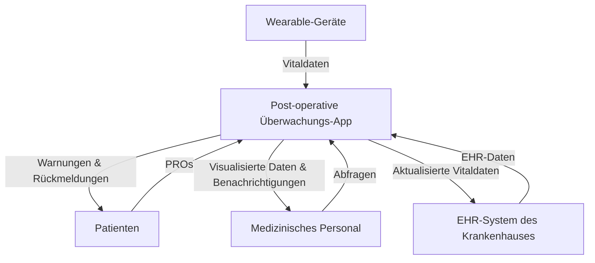
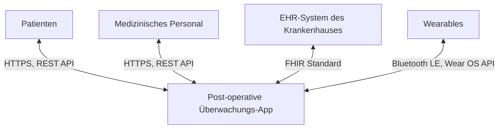
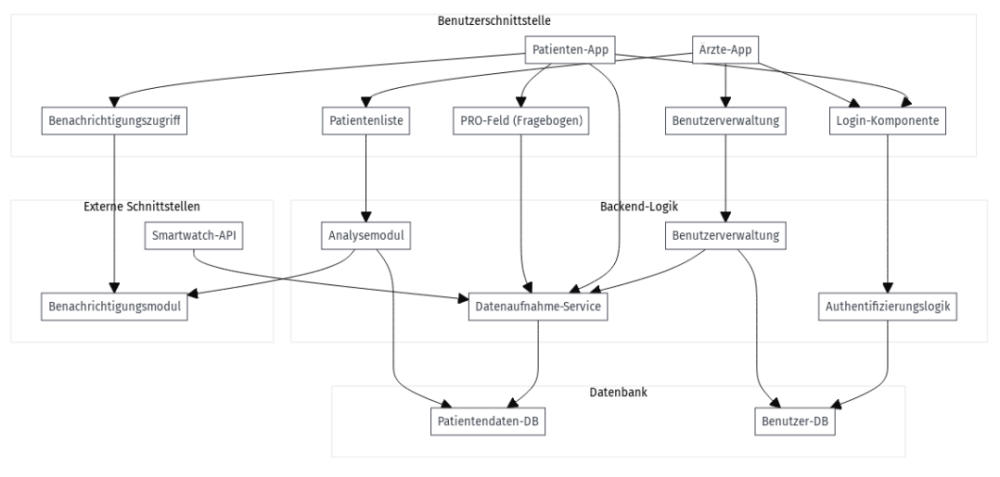
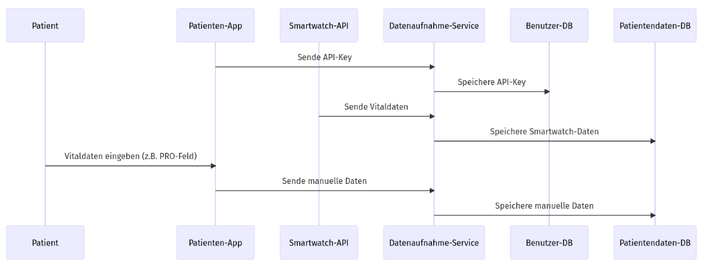
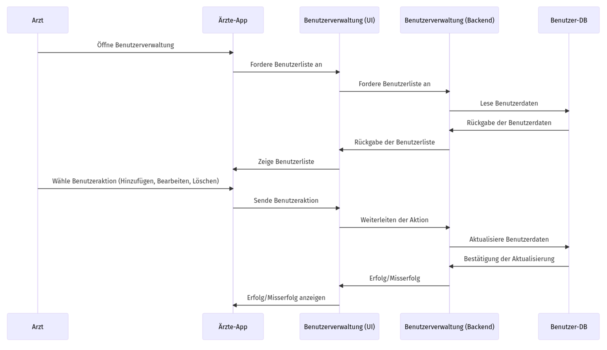
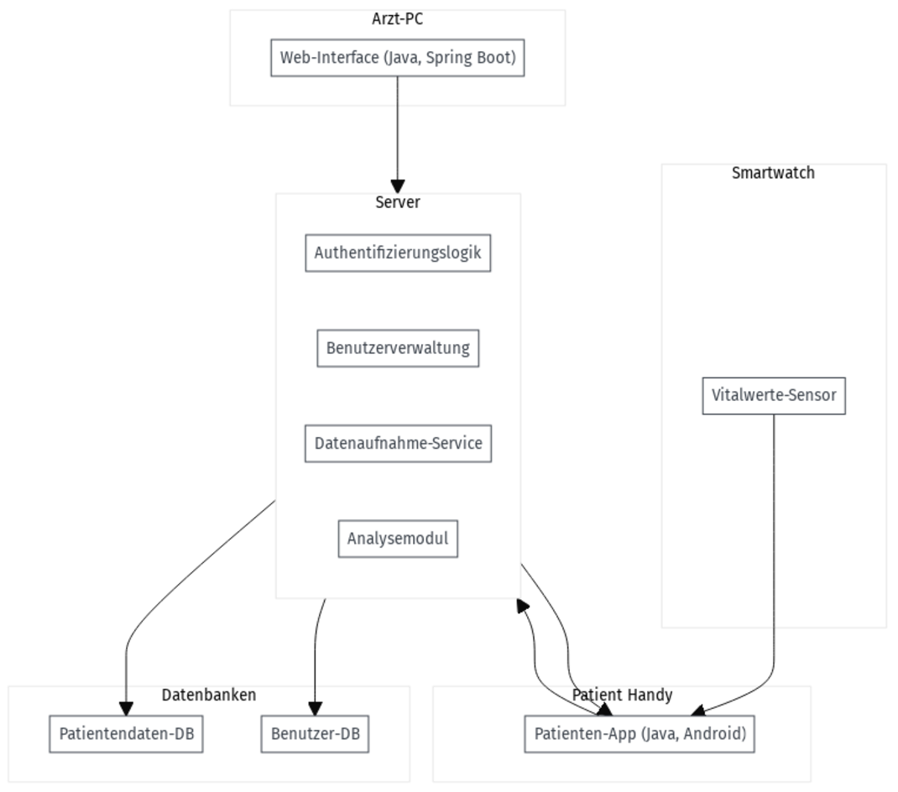

# Über das Projekt: Postoperative Überwachungs-App ⊹₊⟡⋆

Created and maintained by Dustin Scharf and Vincent Putzke.

# 1. Einführung und Ziele ᡣ𐭩 •｡ৎ ˚⋅

Die zu entwickelnde App zielt darauf ab, postoperative Komplikationen bei Patienten, insbesondere Sepsis, nach Herzschrittmacher-Operationen frühzeitig zu erkennen, sobald diese die stetige Überwachung des Krankenhauses verlassen haben. Dies geschieht durch den Einsatz von Wearables, die relevante Vitalparameter kontinuierlich messen und zusammen mit Patient Reported Outcomes (PROs) und elektronischen Gesundheitsakten (EHRs) dem medizinischen Personal visualisiert werden.

Das primäre Ziel der App ist es, die Überwachung der Patienten auch nach der Entlassung fortzusetzen, um eine frühzeitige Erkennung von Komplikationen zu ermöglichen. Dadurch wird die Qualität der Patientenversorgung verbessert und potenzielle Risiken minimiert.

## Aufgabenstellung

Die Aufgabe wurde in 3 Use Cases geteielt:

| Use Case | Beschreibung |
|----------|--------------|
| UC-01    | Erfassung von Daten über die Patienten durch PRO oder Smartwatch |
| UC-02    | Integration/Analyse der Daten |
| UC-03    | Visualisierung der Daten und ggf. Warnungen senden |

## Qualitätsziele

Die Qualitätsziele sind wie folgt:

| Ziel                           | Beschreibung |
|---------------------------------|--------------|
| **Zuverlässigkeit**             | Die App muss Vitaldaten zuverlässig erfassen und entsprechend des aktuellen Status reagieren. |
| **Sicherheit und Datenschutz**  | Die App muss höchsten Sicherheitsstandards entsprechen, um sensible Patientendaten zu schützen. |
| **Benutzerfreundlichkeit**      | Das System muss über eine intuitive Bedienung sowie effektive Oberfläche verfügen. |

## Qualitätsszenarien

Aus den Qualitätszielen entspringen u. a. die folgenden Qualitätsszenarien:

### 1. Zuverlässigkeit
- **Stimulus:** Die App empfängt kontinuierlich Vitaldaten eines Patienten nach einer Herzoperation.
- **Gegenstand/Artefakt:** Verarbeitung der Vitaldaten durch die App.
- **Antwort:** Die App erkennt Anzeichen einer Sepsis und gibt eine Warnung aus.
- **Antwortmaß:** 100% der Sepsis-Anzeichen werden auch als Warnung ausgegeben.

### 2. Sicherheit und Datenschutz
- **Stimulus:** Patientendaten werden an die App übermittelt und verarbeitet.
- **Gegenstand/Artefakt:** Sicherheitsmechanismen der App (z. B. Verschlüsselung, Zugriffsbeschränkungen).
- **Antwort:** Die Daten werden sicher gespeichert und nur autorisierten Personen zugänglich gemacht.
- **Antwortmaß:** Einhaltung von Standards wie der DSGVO; keine Datenlecks (selbst wenn die DB gehackt wurde) oder unautorisierte Zugriffe.

### 3. Benutzerfreundlichkeit
- **Stimulus:** Ein Patient gibt manuell Daten (PRO) in die App ein.
- **Gegenstand/Artefakt:** Benutzeroberfläche der App.
- **Antwort:** Der Benutzer kann die Daten problemlos und schnell eingeben, und die App liefert klare Bestätigungen oder Fehlermeldungen. Zeitgleich werden unbemerkt Daten von der Uhr ausgelesen.
- **Antwortmaß:** Maximale 1 Klick nach Login bis zur PRO Eingabe und keine Anzeichen von der Datenerfassung auf der Uhr im Hintergrund, außer ggf. Fehler, die der Patient einfach beheben könnte.

## Stakeholder

An der App sind beteiligt:

| Rolle/Name                    | Kontakt                      | Erwartungen |
|-------------------------------|------------------------------|-------------|
| **Medizinisches Personal**     | Krankenhaus                   | Zuverlässige und rechtzeitige Warnungen bei Komplikationen, klare Visualisierungen der Gesundheitsdaten. |
| **Patienten**                  | Herzschrittmacher-Patienten   | Einfache Bedienbarkeit der App zur Eingabe von PROs, Vertrauen in die Datensicherheit. |
| **Entwicklungsteam**           | Softwareentwickler der BTU    | Klare Spezifikationen und Anforderungen zur Umsetzung der App. |

# 2. Randbedingungen ≽^• ˕ • ྀི≼
In diesem Abschnitt werden die wesentlichen Einschränkungen beschrieben, die die Softwarearchitekten bei ihren Design- und Implementierungsentscheidungen sowie im Entwicklungsprozess beachten müssen. Diese Einschränkungen können technischer, organisatorischer oder rechtlicher Natur sein und beeinflussen maßgeblich die Architektur der Anwendung.

### Technische Bedinungen

| Constraint                                   | Beschreibung |
|----------------------------------------------|--------------|
| **Einhaltung des FHIR-Standards**            | Die Anwendung muss den FHIR (Fast Healthcare Interoperability Resources)-Standard für den Austausch von Gesundheitsdaten erfüllen, um die Interoperabilität mit Krankenhaus-EHR-Systemen zu gewährleisten. |
| **Wearable-Integration**                     | Die Anwendung muss mit den vom Lehrstuhl bereitgestellten Samsung Galaxy Watch 6 Wearables und Samsung Galaxy A15 Smartphones kompatibel sein. |
| **Mobile Plattform**                         | Die Anwendung muss auf Android-Geräten (Android 14) lauffähig sein und den Android Health Services und Wear OS-APIs folgen. |
| **Web-Integration**                          | Die Anwendung muss als Website verfügbar sein und den gängigen Web-Anforderungen genügen.
| **Sicherheitsrichtlinien**                   | Es müssen strenge Sicherheitsstandards, wie z.B. Verschlüsselung von Gesundheitsdaten, Passwortschutz und Zugriffskontrollen, eingehalten werden. |
| **Sepsisrichtlinien**                        | Die Anwendung soll den aktuellen medizinischen Sepsisrichtlinien entsprechen, um eine präzise und evidenzbasierte Überwachung zu ermöglichen. |

### Organisatorische and Politische Bedingungen

| Constraint                                   | Beschreibung |
|----------------------------------------------|--------------|
| **Datenschutzrichtlinien**                   | Die App muss die EU-Datenschutz-Grundverordnung (DSGVO) einhalten, insbesondere in Bezug auf die Verarbeitung und Speicherung sensibler Gesundheitsdaten. |
| **Zusammenarbeit mit Biotronik**             | Die Anforderungen und Richtlinien des Partners Biotronik müssen berücksichtigt werden, da dieser die Anforderungen an die Wearables und das Monitoring beeinflusst. |
| **Einhaltung der BTU-Richtlinien**           | Die App-Entwicklung muss den universitätsinternen Vorgaben und Prüfungsrichtlinien für studentische Projekte entsprechen, z.B. in Bezug auf Dokumentation und Code-Qualität. |

### Konventionen

| Constraint                                   | Beschreibung |
|----------------------------------------------|--------------|
| **Programmierrichtlinien**                   | Es gelten die allgemeinen Programmierstandards für Java auf Android, insbesondere saubere Code-Architektur. |
| **Versionsverwaltung**                       | Die Versionskontrolle erfolgt über Git, und alle Teammitglieder müssen strikte Branching- und Merging-Richtlinien befolgen. |
| **Dokumentationsanforderungen**              | Eine kontinuierliche und strukturierte Projektdokumentation ist erforderlich. |

# 3. Kontextabgrenzung ✩₊˚.⋆☾⋆⁺₊✧

Dieser Abschnitt beschreibt den Systemkontext und grenzt das System von seinen Kommunikationspartnern (Nutzern und anderen Systemen) ab. Es wird definiert, welche externen Schnittstellen für den Austausch von Daten relevant sind.

## Fachlicher Kontext

Die post-operative Überwachungs-App kommuniziert mit folgenden Partnern:

| Kommunikationspartner    | Eingaben (Input)                                        | Ausgaben (Output)                                        |
|--------------------------|--------------------------------------------------------|----------------------------------------------------------|
| **Patienten**             | Eingabe von PROs (z.B. Symptome, Wohlbefinden) über die mobile App | Warnungen und Rückmeldungen über Gesundheitszustand      |
| **Medizinisches Personal**| Abfrage der Patienten-Vitaldaten und EHRs              | Visualisierte Gesundheitsdaten und Benachrichtigungen bei Abweichungen |
| **EHR-System des Krankenhauses**| Elektronische Gesundheitsdaten der Patienten (EHR-Daten) | Aktualisierte Vitaldaten der Patienten zur Integration in das EHR |
| **Wearable-Geräte (Samsung Galaxy Watch 6)**| Kontinuierlich gemessene Vitaldaten (z.B. Herzfrequenz, Temperatur) | Gesendete Vitaldaten an die App zur Visualisierung und Analyse |

Für die Tests wird ein Synthea-Datensatz bereitgestellt, der Gesundheitsdaten in verschiedenen Stufen enthält und als valide Grundlage zur Prototypentwicklung dient.

## Technischer Kontext

Das System nutzt verschiedene technische Schnittstellen, um die relevanten Daten zu übertragen:

| Kommunikationspartner      | Kanal                                      | Protokoll/Technologie                      |
|----------------------------|--------------------------------------------|--------------------------------------------|
| **Patienten**               | Mobile App über Android-Geräte             | HTTPS, REST API                            |
| **Medizinisches Personal**  | Web-basierte Benutzeroberfläche            | HTTPS, REST API                            |
| **EHR-System des Krankenhauses**| Direkte Integration über Krankenhausnetzwerk | FHIR (Fast Healthcare Interoperability Resources) Standard |
| **Wearables (Samsung Galaxy Watch 6)**| Bluetooth-Verbindung zu Smartphones     | Bluetooth LE, Wear OS API                  |

# 4. Lösungsstrategie ⋆*˚｡⋆

Das Problem soll mithilfe der Berücksichtigung folger Punkte gelöst werden:

1. **Architekturansatz:**  
   - **Schichtenarchitektur:**  
     Das System ist in klar getrennte Schichten unterteilt:  
     - Frontend: Patienten-App und Ärzte-Webinterface.  
     - Backend: Server mit Authentifizierung, Benutzerverwaltung, Datenaufnahme und Analysemodul.  
     - Datenhaltung: Patientendaten- und Benutzer-Datenbank.  

2. **Technologieauswahl:**  
   - **Frontend:**  
     - Patienten-App: Native App mit **Java (Android)** für optimale Leistung und Zugriff auf native Gerätefunktionen wie Sensoren.  
     - Ärzte-Webinterface: Webanwendung mit **Java (Spring Boot)** für hohe Flexibilität und einfache Verfügbarkeit.  
   - **Backend:**  
     - Server: Java-basierter Ansatz für die zentrale Verarbeitung und Integration.  
   - **Datenbanken:**  
     - **ENTWEDER:** Relationale Datenbanken wie **PostgreSQL** oder **MySQL** zur >strukturierten< Speicherung und Abfrage der Benutzerdaten und Vitalwerte.
     - **ODER:** JSON Datenbanken wie **MongoDB** oder **Google Firebase Realtime Database**, zur >unstrukturierten< Speicherung der Daten.

3. **Datenintegration:**  
   - **Smartwatch-API:**  
     - Integration mit APIs der Smartwatch-Hersteller (z. B. Google Fit) zur kontinuierlichen Erhebung von Vitalwerten.  
   - **Benutzerinteraktion:**  
     - Zusätzliche Eingabe von Daten durch Patienten über das PRO-Feld in der App.  

4. **Sicherheitsstrategie:**  
   - **Authentifizierung und Autorisierung:**  
     - Zentrale Authentifizierung mit z. B. **Google Firebase Authentication**, **OAuth2** oder **JWT (JSON Web Token)** und **Spring Security** zur sicheren Kommunikation zwischen den Komponenten.  
     - Trennung der Benutzerrollen (Patient/Arzt).  
   - **Datenschutz:**  
     - Verschlüsselte Speicherung (z. B. AES-256) aller Daten in der Datenbank.  
     - Verwendung von HTTPS für die gesamte Kommunikation.  

5. **Fehler- und Ausnahmebehandlung:**  
   - **Robuste Kommunikation:**  
     - Retries (oder sogar Fallbacks) für die Kommunikation mit der Smartwatch-API und der Benachrichtigungsinfrastruktur.  
   - **Datenvalidierung:**  
     - Validierung von Eingabedaten sowohl auf App- als auch auf Serverseite, um inkonsistente oder fehlerhafte Daten zu vermeiden.  

6. **Skalierbarkeit und Erweiterbarkeit:**  
   - **Modularer Aufbau:**  
     - Komponenten wie Analysemodul oder Benachrichtigungsmodul sind isoliert und können unabhängig weiterentwickelt werden.  
   - **Cloud-basierter Ansatz:**  
     - Möglichkeit, die Server- und Datenbankkomponenten auf Cloud-Umgebungen wie z. B. **Google Firebase**, **AWS** oder **Azure** zu deployen.  

7. **Benachrichtigungen:**  
   - Verwendung von z. B. **Push-Benachrichtigungen**, **SMS** oder **E-Mails**, um Patienten aktiv auf kritische Werte oder Eingabefristen hinzuweisen.  

# 5. Bausteinsicht (´｡•᎑•`)っ <3

# 6. Laufzeitsicht ⋆⁺₊❅.
## Daten erheben und speichern(/integrieren) 

## Daten anzeigen und analysieren

## Nutzer verwalten
Die Nutzerverwaltung setzt voraus, dass der Arzt eingeloggt ist

# 7. Verteilungssicht ₊✩‧₊˚౨ৎ˚₊✩‧₊

# 8. Querschnittliche Konzepte 𓅰 𓅬 𓅭 𓅮 𓅯

# 9. Architekturentscheidungen ₊˚ʚ ᗢ₊˚✧ ﾟ.

# 10. Qualitätsanforderungen ˖⁺‧₊˚♡˚₊‧⁺˖

# 11. Risiken und technische Schulden ⋆༺𓆩☠︎︎𓆪༻⋆

# 12. Glossar ١٥٧٤♡

Mit dem Glossar versuchen wir, alle ggf. unklaren Worte in dem Dokument zu definieren:

| Begriff                  | Definition                                                                                  |
|--------------------------|---------------------------------------------------------------------------------------------|
| EHR                      | Electronic Health Record (Elektronische Patientenakte)                                     |
| PRO                      | Patient Reported Outcome                                                                   |
| Sepsis                   | Lebensbedrohliche Komplikation einer Infektion, die zu Organversagen führen kann           |
| Wearable                 | Am Körper getragenes elektronisches Gerät zur Messung von Gesundheitsdaten                 |
| DSGVO                    | Datenschutz-Grundverordnung                                                               |
| Frühdiagnose             | Erkennung einer Krankheit in einem frühen Stadium                                         |
| Herzschrittmacher        | Implantierbares medizinisches Gerät zur Regulierung des Herzrhythmus                       |
| Postoperative Komplikation | Unerwünschte Folge nach einer Operation                                                  |
| Synthea-Datensatz        | Synthetisch generierter Datensatz für medizinische Forschung und Entwicklung               |
| Medizinisches Personal   | Ärzte, Pflegekräfte und andere Gesundheitsfachkräfte                                      |
| Visualisierung           | Grafische Darstellung von Daten zur besseren Verständlichkeit                             |
| Richtlinie               | Festgelegte Regeln oder Grenzwerte für medizinische Parameter                             |
| Patienten-App            | Mobile Applikation (Android, Java) zur Eingabe und Anzeige von Gesundheitsdaten durch Patienten |
| Ärzte-App                | Webinterface (Java, Spring Boot) zur Verwaltung und Einsicht von Patientendaten durch Ärzte |
| Authentifizierungslogik  | Komponente zur sicheren Überprüfung der Benutzeridentität                                 |
| Benutzerverwaltung       | Mechanismus zur Pflege und Steuerung von Benutzerrollen, Anmeldedaten und Berechtigungen  |
| Analysemodul             | Backend-Komponente zur kontinuierlichen Überwachung und Analyse von Gesundheitsdaten      |
| Benachrichtigungsmodul   | System zur Kommunikation kritischer Ereignisse oder Erinnerungen an Benutzer              |
| Benachrichtigszugriff    | Schnittstelle in der Patienten-App zur Anzeige von Benachrichtigungen                     |
| Datenaufnahme-Service    | Backend-Komponente zur Verarbeitung und Speicherung eingehender Daten (z. B. Vitalwerte)  |
| Smartwatch-API           | Schnittstelle zur Erhebung von Vitaldaten über Wearables                                  |
| Patientendaten-DB        | Datenbank zur Speicherung von Gesundheitsdaten der Patienten                              |
| Benutzer-DB              | Datenbank zur Speicherung von Benutzerdaten und Berechtigungen                           |
| Verteilungssicht         | Darstellung, wie die Systemkomponenten physisch oder logisch auf Infrastruktur verteilt sind |
| Laufzeitsicht            | Modell der dynamischen Interaktionen zwischen Systemkomponenten in spezifischen Szenarien |

# arc42-Template (ෆ˙ᵕ˙ෆ)♡

Dieses Dokument folgt dem arc42-Template zur Dokumentation von Software- und Systemarchitekturen.

Template Version 8.2 DE. (basiert auf AsciiDoc Version), Januar 2023

Created, maintained and © by Dr. Peter Hruschka, Dr. Gernot Starke and contributors. Siehe <https://arc42.org>.