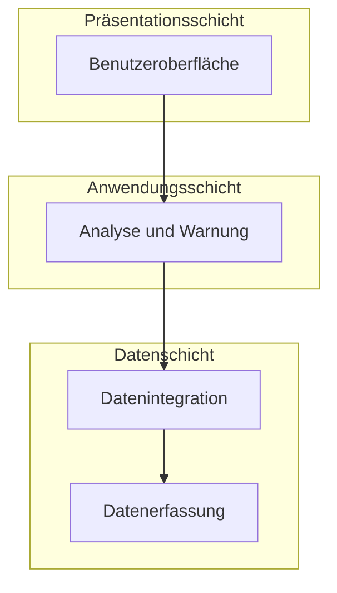
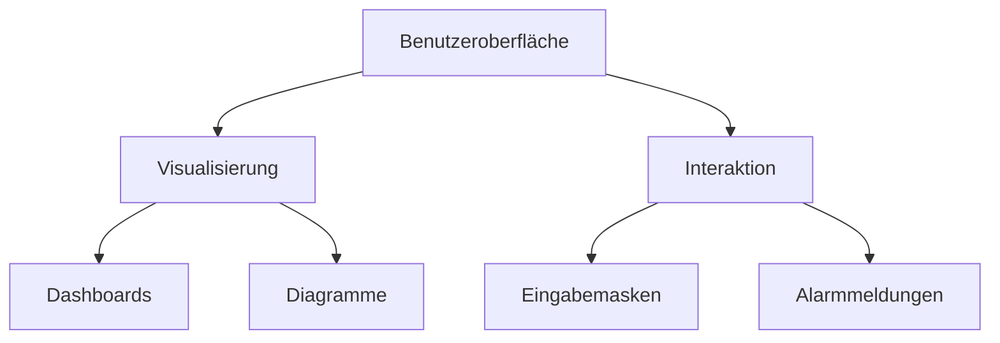
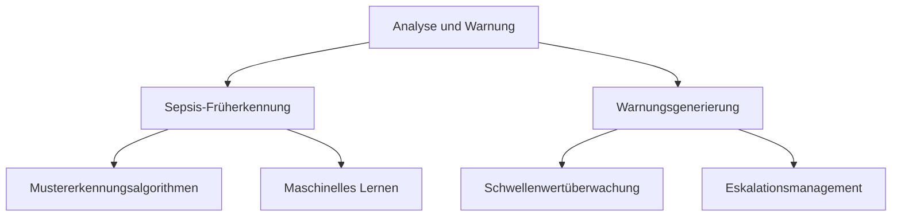
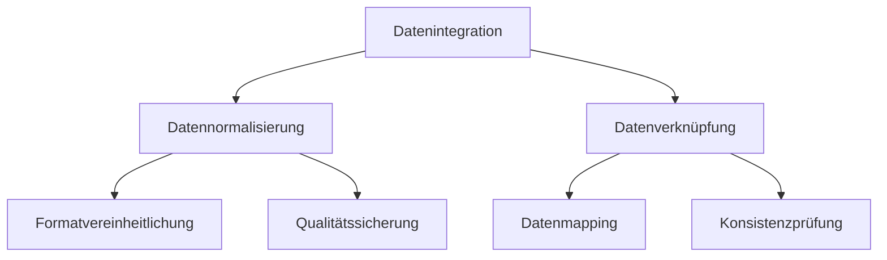
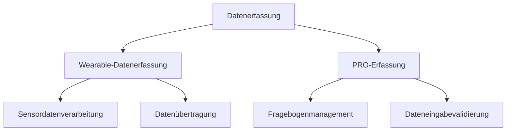
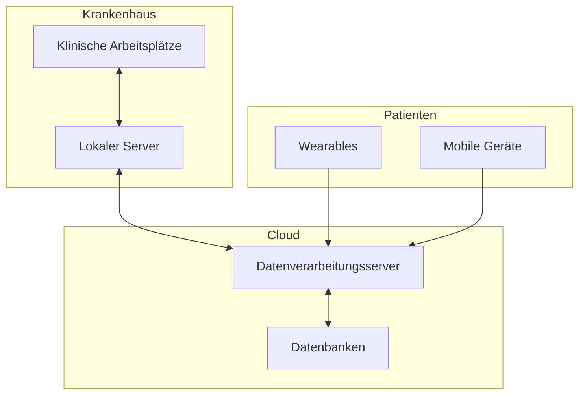
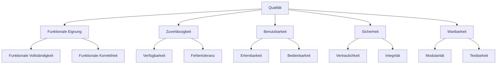

# Über das Projekt: Postoperative Überwachungs-App

Created and maintained by Dustin Scharf and Vincent Putzke.

# 1. Einführung und Ziele

Die zu entwickelnde App zielt darauf ab, postoperative Komplikationen bei Patienten, insbesondere Sepsis, nach Herzschrittmacher-Operationen frühzeitig zu erkennen, sobald diese die stetige Überwachung des Krankenhauses verlassen haben. Dies geschieht durch den Einsatz von Wearables, die relevante Vitalparameter kontinuierlich messen und zusammen mit Patient Reported Outcomes (PROs) und elektronischen Gesundheitsakten (EHRs) dem medizinischen Personal visualisiert werden.

Das primäre Ziel der App ist es, die Überwachung der Patienten auch nach der Entlassung fortzusetzen, um eine frühzeitige Erkennung von Komplikationen zu ermöglichen. Dadurch wird die Qualität der Patientenversorgung verbessert und potenzielle Risiken minimiert.

## Aufgabenstellung
Die Anwendung muss folgende funktionale Anforderungen erfüllen:
- **Kontinuierliche Überwachung von Vitalwerten** (z.B. Temperatur, Herzfrequenz, Atemfrequenz) mittels Wearables.
- **Eingabe von PROs** über eine mobile App.
- **Warnsystem** zur Benachrichtigung des medizinischen Personals.
- **Visualisierung der Gesundheitsdaten** in Dashboards.

| Use Case | Beschreibung |
|----------|--------------|
| UC-01    | Erfassung von Daten über die Patienten |
| UC-02    | Visualisierung der Daten |
| UC-03    | Integration der Daten |

## Qualitätsziele

| Ziel                           | Beschreibung |
|---------------------------------|--------------|
| **Zuverlässigkeit**             | Die App muss Vitaldaten zuverlässig erfassen und entsprechend des aktuellen Status reagieren. |
| **Sicherheit und Datenschutz**  | Die App muss höchsten Sicherheitsstandards entsprechen, um sensible Patientendaten zu schützen. |
| **Benutzerfreundlichkeit**      | Das System muss über eine intuitive Bedienung sowie effektive Oberfläche verfügen. |

## Stakeholder

| Rolle/Name                    | Kontakt                      | Erwartungen |
|-------------------------------|------------------------------|-------------|
| **Medizinisches Personal**     | Krankenhaus, z.B. Dr. Meier   | Zuverlässige und rechtzeitige Warnungen bei Komplikationen, klare Visualisierungen der Gesundheitsdaten. |
| **Patienten**                  | Herzschrittmacher-Patienten   | Einfache Bedienbarkeit der App zur Eingabe von PROs, Vertrauen in die Datensicherheit. |
| **Entwicklungsteam**           | Softwareentwickler der BTU    | Klare Spezifikationen und Anforderungen zur Umsetzung der App. |
| **Biotronik**                  | Industriepartner              | Einblicke in die prototypische Implementierung von Home Monitoring durch Wearable-Technologie. |
| **Datenschutzbeauftragter**    | Interne Datenschutzabteilung  | Einhaltung der Datenschutzrichtlinien, insbesondere bei der Nutzung sensibler Gesundheitsdaten. |

# 2. Randbedingungen
In diesem Abschnitt werden die wesentlichen Einschränkungen beschrieben, die die Softwarearchitekten bei ihren Design- und Implementierungsentscheidungen sowie im Entwicklungsprozess beachten müssen. Diese Einschränkungen können technischer, organisatorischer oder rechtlicher Natur sein und beeinflussen maßgeblich die Architektur der Anwendung.

### Technische Bedinungen

| Constraint                                   | Beschreibung |
|----------------------------------------------|--------------|
| **Einhaltung des FHIR-Standards**            | Die Anwendung muss den FHIR (Fast Healthcare Interoperability Resources)-Standard für den Austausch von Gesundheitsdaten erfüllen, um die Interoperabilität mit Krankenhaus-EHR-Systemen zu gewährleisten. |
| **Wearable-Integration**                     | Die Anwendung muss mit den vom Lehrstuhl bereitgestellten Samsung Galaxy Watch 6 Wearables und Samsung Galaxy A15 Smartphones kompatibel sein. |
| **Mobile Plattform**                         | Die Anwendung muss auf Android-Geräten (Android 14) lauffähig sein und den Android Health Services und Wear OS-APIs folgen. |
| **Web-Integration**                          | Die Anwendung muss als Website verfügbar sein und den gängigen Web-Anforderungen genügen.
| **Sicherheitsrichtlinien**                   | Es müssen strenge Sicherheitsstandards, wie z.B. Verschlüsselung von Gesundheitsdaten, Passwortschutz und Zugriffskontrollen, eingehalten werden. |
| **Sepsisrichtlinien**                        | Die Anwendung soll den aktuellen medizinischen Sepsisrichtlinien entsprechen, um eine präzise und evidenzbasierte Überwachung zu ermöglichen. |

### Organisatorische and Politische Bedingungen

| Constraint                                   | Beschreibung |
|----------------------------------------------|--------------|
| **Datenschutzrichtlinien**                   | Die App muss die EU-Datenschutz-Grundverordnung (DSGVO) einhalten, insbesondere in Bezug auf die Verarbeitung und Speicherung sensibler Gesundheitsdaten. |
| **Zusammenarbeit mit Biotronik**             | Die Anforderungen und Richtlinien des Partners Biotronik müssen berücksichtigt werden, da dieser die Anforderungen an die Wearables und das Monitoring beeinflusst. |
| **Einhaltung der BTU-Richtlinien**           | Die App-Entwicklung muss den universitätsinternen Vorgaben und Prüfungsrichtlinien für studentische Projekte entsprechen, z.B. in Bezug auf Dokumentation und Code-Qualität. |

### Konventionen

<!-- LL: techn. Spezifikationen werden nur von den Architects erstellt, nicht von den SWP Studierenden. Bitte bei den Stakeholdern einen Unterschied machen zwischen Studierenden im Softwarepraktikum und die unterschiedliche Arten von Coaches (Agile bzw. Architects & Quality Coaches) -->

| Constraint                                   | Beschreibung |
|----------------------------------------------|--------------|
| **Programmierrichtlinien**                   | Es gelten die allgemeinen Programmierstandards für Java/Kotlin _(s.t.c)_ auf Android, insbesondere saubere Code-Architektur. |
| **Versionsverwaltung**                       | Die Versionskontrolle erfolgt über Git, und alle Teammitglieder müssen strikte Branching- und Merging-Richtlinien befolgen. |
| **Dokumentationsanforderungen**              | Eine kontinuierliche und strukturierte Projektdokumentation ist erforderlich. |

# 3. Kontextabgrenzung

Dieser Abschnitt beschreibt den Systemkontext und grenzt das System von seinen Kommunikationspartnern (Nutzern und anderen Systemen) ab. Es wird definiert, welche externen Schnittstellen für den Austausch von Daten relevant sind.

<!-- LL: Visualisierungen des Kontexts hinzufügen, siehe HTML Sanity Checker für Beispieldiagramme -->

## Fachlicher Kontext

Die post-operative Überwachungs-App kommuniziert mit folgenden Partnern:

| Kommunikationspartner    | Eingaben (Input)                                        | Ausgaben (Output)                                        |
|--------------------------|--------------------------------------------------------|----------------------------------------------------------|
| **Patienten**             | Eingabe von PROs (z.B. Symptome, Wohlbefinden) über die mobile App | Warnungen und Rückmeldungen über Gesundheitszustand      |
| **Medizinisches Personal**| Abfrage der Patienten-Vitaldaten und EHRs              | Visualisierte Gesundheitsdaten und Benachrichtigungen bei Abweichungen |
| **EHR-System des Krankenhauses**| Elektronische Gesundheitsdaten der Patienten (EHR-Daten) | Aktualisierte Vitaldaten der Patienten zur Integration in das EHR |
| **Wearable-Geräte (Samsung Galaxy Watch 6)**| Kontinuierlich gemessene Vitaldaten (z.B. Herzfrequenz, Temperatur) | Gesendete Vitaldaten an die App zur Visualisierung und Analyse |

Für die Tests wird ein Synthea-Datensatz bereitgestellt, der Gesundheitsdaten in verschiedenen Stufen enthält und als valide Grundlage zur Prototypentwicklung dient.

## Technischer Kontext

Das System nutzt verschiedene technische Schnittstellen, um die relevanten Daten zu übertragen:

| Kommunikationspartner      | Kanal                                      | Protokoll/Technologie                      |
|----------------------------|--------------------------------------------|--------------------------------------------|
| **Patienten**               | Mobile App über Android-Geräte             | HTTPS, REST API                            |
| **Medizinisches Personal**  | Web-basierte Benutzeroberfläche            | HTTPS, REST API                            |
| **EHR-System des Krankenhauses**| Direkte Integration über Krankenhausnetzwerk | FHIR (Fast Healthcare Interoperability Resources) Standard |
| **Wearables (Samsung Galaxy Watch 6)**| Bluetooth-Verbindung zu Smartphones     | Bluetooth LE, Wear OS API                  |

Der Synthea-Datensatz wird zunächst offline und später in einer serverbasierten Umgebung bereitgestellt, um eine testweise Integration zu simulieren.

# 4. Lösungsstrategie

1. Agile Entwicklungsmethodik
    Schrittweise Umsetzung mit Fokus auf Kernfunktionen
2. Nutzerorientiertes Design
    Einbeziehung von Endnutzern und iterative Verbesserung der Bedienbarkeit
3. Modellgetriebene Softwareentwicklung
    Einsatz von Domänenmodellen und spezifischen Sprachen für effiziente Entwicklung
4. Qualitätssicherung durch Modellierung
    Nutzung von Modellen für Tests und Konsistenzprüfungen
5. Datenmanagement
    Integration und Verarbeitung verschiedener Datenquellen
6. IT-Sicherheit und Datenschutz
    Implementierung von Schutzmaßnahmen und Einhaltung von Richtlinien
7. Zukunftssichere Systemarchitektur
    Modularer Aufbau für Erweiterbarkeit und Skalierbarkeit
8. Regulatorische Konformität
    Einhaltung von Vorschriften für Medizinprodukte-Software
9. Benutzerfreundliche Darstellung
    Entwicklung intuitiver Visualisierungen für komplexe Daten
10. Telemedizinische Funktionen
    Integration von Fernüberwachungs- und -interventionsmöglichkeiten

# 5. Bausteinsicht

## Whitebox Gesamtsystem

Enthaltene Bausteine  

1. Präsentationsschicht:
    - Benutzeroberfläche:
        Stellt Daten für medizinisches Personal dar und ermöglicht Interaktion
2. Anwendungsschicht:
    - Analyse und Warnung:
        Führt Sepsis-Früherkennung durch und generiert Warnungen
3. Datenschicht:
    - Datenintegration:
        Integriert Daten aus Wearables, PROs und EHR-Systemen
    - Datenerfassung:
        Verantwortlich für die Erfassung von Wearable-Daten und Patient Reported Outcomes (PROs)

## Ebene 2

### Benutzeroberfläche

Die Benutzeroberfläche ist verantwortlich für die Darstellung der Daten und die Interaktion mit dem medizinischen Personal. Sie umfasst:
- Visualisierung: Erstellt Dashboards und Diagramme zur übersichtlichen Darstellung der Patientendaten.
- Interaktion: Bietet Eingabemasken für manuelle Dateneingabe und zeigt Alarmmeldungen bei kritischen Zuständen an.

### Analyse und Warnung

Die Analyse- und Warnungskomponente führt die Sepsis-Früherkennung durch und generiert Warnungen. Sie beinhaltet:
- Sepsis-Früherkennung: Nutzt Mustererkennungsalgorithmen und maschinelles Lernen zur Identifikation von Sepsis-Anzeichen.
- Warnungsgenerierung: Überwacht Schwellenwerte und verwaltet das Eskalationsmanagement für kritische Zustände.

### Datennitegration

Die Datenintegrationskomponente ist für die Zusammenführung von Daten aus verschiedenen Quellen verantwortlich:
- Datennormalisierung: Vereinheitlicht Datenformate und führt Qualitätssicherungsmaßnahmen durch.
- Datenverknüpfung: Erstellt Mappings zwischen verschiedenen Datenquellen und prüft die Konsistenz der integrierten Daten.

### Datenerfassung

Die Datenerfassungskomponente sammelt Daten von Wearables und Patient Reported Outcomes (PROs):
- Wearable-Datenerfassung: Verarbeitet Sensordaten und überträgt sie sicher an das System.
- PRO-Erfassung: Verwaltet digitale Fragebögen und validiert die eingegebenen Daten.

*\<ausstehend>*

# 6. Laufzeitsicht

## *\<Bezeichnung Laufzeitszenario 1>*

-   \<hier Laufzeitdiagramm oder Ablaufbeschreibung einfügen>

-   \<hier Besonderheiten bei dem Zusammenspiel der Bausteine in diesem
    Szenario erläutern>

## *\<Bezeichnung Laufzeitszenario 2>*

…

## *\<Bezeichnung Laufzeitszenario n>*

…

# 7. Verteilungssicht

## Infrastruktur Ebene 1

### Konzept
Das Frühdiagnose-System ist auf mehrere Knoten verteilt, um Skalierbarkeit, Leistung und Datensicherheit zu gewährleisten:
- Klinische Arbeitsplätze:
  Ausführung der Benutzeroberfläche
    Zugriff über Webbrowser oder dedizierte Anwendung
- Lokaler Krankenhausserver:
    Zwischenspeicherung von Daten für schnellen Zugriff
    Ausführung lokaler Analysen
    Sicherstellung der Systemverfügbarkeit bei Netzwerkproblemen
- Cloud-Datenverarbeitungsserver:
    Ausführung der Hauptanalyse- und Warnungskomponenten
    Verarbeitung von Daten aus verschiedenen Quellen
    Skalierbare Ressourcen für Spitzenlasten
- Cloud-Datenbanken:
    Zentrale Speicherung aller Patientendaten
    Getrennte Datenbanken für verschiedene Datentypen (z.B. Wearable-Daten, PROs, EHR)
- Wearables:
    Erfassung von Vitalparametern
    Lokale Vorverarbeitung der Daten
- Mobile Geräte der Patienten:
    Erfassung von PROs über mobile Apps
    Mögliche Anzeige von personalisierten Gesundheitsinformationen

### Bausteine in Infrastruktur

- **Benutzeroberfläche**: Klinische Arbeitsplätze, Mobile Geräte
- **Analyse und Warnung**: Cloud-Datenverarbeitungsserver, teilweise auf lokalem Krankenhausserver
- **Datenintegration**: Cloud-Datenverarbeitungsserver
- **Datenerfassung**: Wearables, Mobile Geräte, teilweise auf Cloud-Datenverarbeitungsserver

### Technologien

- **Netzwerk**: Gesichertes Krankenhaus-LAN, verschlüsselte Internetverbindungen
- **Datenbanken**: Fire-Datenbank
- **Wearables**: Android-Smartwatches
- **Mobile Apps**: auf Android-Geräten

## Infrastruktur Ebene 2

### *\<Infrastrukturelement 1>*

*\<Diagramm + Erläuterungen>*

### *\<Infrastrukturelement 2>*

*\<Diagramm + Erläuterungen>*

…

### *\<Infrastrukturelement n>*

*\<Diagramm + Erläuterungen>*

# 8. Querschnittliche Konzepte

## *\<Konzept 1>*

*\<Erklärung>*

## *\<Konzept 2>*

*\<Erklärung>*

…

## *\<Konzept n>*

*\<Erklärung>*

# 9. Architekturentscheidungen

# 10. Qualitätsanforderungen

**Weiterführende Informationen**

Siehe [Qualitätsanforderungen](https://docs.arc42.org/section-10/) in
der online-Dokumentation (auf Englisch!).

## Qualitätsbaum

## Qualitätsszenarien

| Ziel                           | Beschreibung |
|---------------------------------|--------------|
| **Zuverlässigkeit**             | Die Anwendung ist 99,9% der Zeit verfügbar, mit einer maximalen Ausfallzeit von 10 Minuten pro Monat. Bei Ausfall eines Wearable-Sensors können die Daten manuell eingegeben werden, ohne die Funktionalität zu beeinträchtigen. |
| **Benutzerfreundlichkeit**      | Medizinisches Personal kann nach maximal 2 Stunden Einweisung die Anwendung effektiv nutzen. Die Eingabe von PROs durch Patienten dauert im Durchschnitt nicht länger als 3 Minuten. |
| **Sicherheit und Datenschutz**  | Alle Patientendaten werden gemäß DSGVO-Richtlinien verschlüsselt gespeichert und übertragen. Jeder Zugriff auf Patientendaten wird protokolliert und ist nachverfolgbar. |
| **Interoperabilität**           | Die Anwendung integriert erfolgreich Daten aus Wearables, PROs und EHR-Daten innerhalb von 5 Minuten nach der Dateneingabe. |
| **Erweiterbarkeit**             | Neue Wearable-Geräte können innerhalb von 2 Arbeitstagen in das System integriert werden. Automatisierte Tests decken mindestens 80% des Codes ab, um die Wartbarkeit zu gewährleisten. |

# 11. Risiken und technische Schulden

# 12. Glossar

| Begriff        | Definition        |
|----------------|-------------------|
| EHR            | Electronic Health Record (Elektronische Patientenakte) |
| PRO            | Patient Reported Outcome |
| Sepsis         | Lebensbedrohliche Komplikation einer Infektion, die zu Organversagen führen kann |
| Wearable       | Am Körper getragenes elektronisches Gerät zur Messung von Gesundheitsdaten |
| DSGVO          | Datenschutz-Grundverordnung |
| Frühdiagnose   | Erkennung einer Krankheit in einem frühen Stadium |
| Herzschrittmacher | Implantierbares medizinisches Gerät zur Regulierung des Herzrhythmus |
| Postoperative Komplikation | Unerwünschte Folge nach einer Operation |
| Synthea-Datensatz | Synthetisch generierter Datensatz für medizinische Forschung und Entwicklung |
| Medizinisches Personal | Ärzte, Pflegekräfte und andere Gesundheitsfachkräfte |
| Visualisierung  | Grafische Darstellung von Daten zur besseren Verständlichkeit |
| Richtlinie     | Festgelegte Regeln oder Grenzwerte für medizinische Parameter |

# arc42-Template

Dieses Dokument folgt dem arc42-Template zur Dokumentation von Software- und Systemarchitekturen.

Template Version 8.2 DE. (basiert auf AsciiDoc Version), Januar 2023

Created, maintained and © by Dr. Peter Hruschka, Dr. Gernot Starke and contributors. Siehe <https://arc42.org>.
